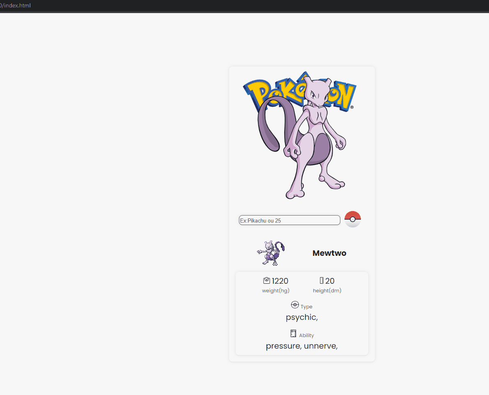

# Projeto Pokedex

### Implementei esse projeto que é uma Pokedex onde os usuários podem buscar pokemons e obter informações.

👀 Dá uma olhada aqui: <https://thiago-levi.github.io/pokedex-project/>

Infos:

- Exibe uma imagem "premium" do pokemon.
- Exibe uma imagem animada do pokemon.
- Exibe nome, peso(hectômetro) e altura(decímetro) do pokemon.
- Exibe o(s) tipo(s) de cada pokemon.
- Exibe uma ou mais habilidades do pokemon.

Infos extras:

- As tags de imagens e aniamações de pokemos possuem o atributo "alt" e "title" com valor do nome do pokemon buscado.

## Tecnologias

  

---

<h2 align="center">Versão Web</h2>

 
___

<h2 align="center">Versão Mobile</h2>

